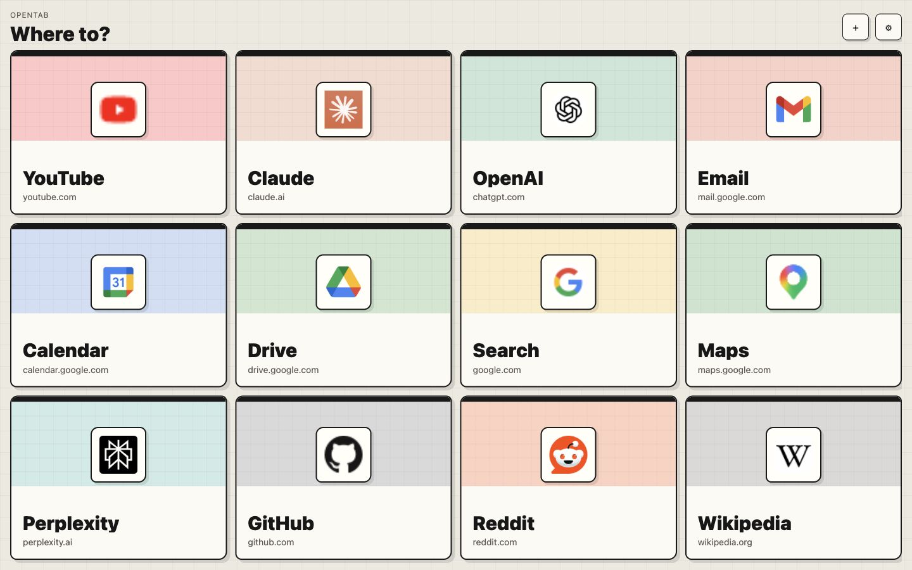

# OpenTab

OpenTab is a free, open-source new tab page for people who mostly want one thing: big, fast links to the sites they actually use.

It is a static, local-first Chrome new tab launcher. There is no account, backend, build step, analytics script, or sync service. Each person who installs it gets their own local copy and their own local settings.



## Live Demo

OpenTab is live at [wey-codes.github.io/opentab](https://wey-codes.github.io/opentab/).

## What It Does

- Shows the link grid on one screen.
- Keeps ten pinned links editable by the user.
- Adds up to two smart slots from frequent Chrome history when installed as a Chrome extension.
- Shows a thin recent-history strip in extension mode.
- Refreshes Chrome history whenever the new tab page loads or becomes active.
- Works as plain static files, an installable mobile web app, or an unpacked Chrome extension.
- Stores settings locally in the current browser.

Default pinned links:

1. YouTube
2. Claude
3. OpenAI
4. Email
5. Calendar
6. X
7. Box
8. Facebook Ads
9. GitHub
10. Reddit

## Install In Chrome

1. Download this repo as a ZIP, or clone it.
2. Unzip it if needed.
3. Open `chrome://extensions` in Chrome.
4. Turn on Developer Mode.
5. Click Load unpacked.
6. Choose the `opentab` folder.
7. Open a new tab.

Chrome may show that OpenTab can read browsing history. OpenTab uses that permission only inside your browser to fill the recent strip and the two smart slots. It checks history on load and again when the tab becomes active. Nothing is sent to a server because there is no server.

## Use Without Installing An Extension

Open `index.html` directly in a browser, or serve the folder with any static file server.

```text
file:///path/to/opentab/index.html
```

The plain file/static version cannot read Chrome history, so it does not guess your most-used sites. A hosted URL opened through a new-tab redirect extension has the same browser limit. To use the history strip and smart slots, install OpenTab itself as the Chrome extension.

## Install On Mobile

Host OpenTab on any static host with HTTPS, then open that URL on your phone.

On iPhone:

1. Open the hosted OpenTab URL in Safari.
2. Tap Share.
3. Tap Add to Home Screen.

On Android:

1. Open the hosted OpenTab URL in Chrome.
2. Tap the menu.
3. Tap Add to Home screen or Install app.

The mobile web app is a fast home-screen launcher for pinned links. Mobile Chrome does not allow this page to read browser history, so the smart history slots remain desktop-extension-only.

## Customize

Use the settings button in the top right to edit pinned links, add links, restore defaults, import, or export your config.

Your custom links are stored locally in your browser. They are not part of this repo and are not shared with other people.

## Privacy

OpenTab is intentionally small and local-first:

- No account
- No backend
- No analytics
- No tracking pixels
- No bundled third-party scripts
- No shared database

See [PRIVACY.md](./PRIVACY.md) for the full plain-English privacy note.

## Publish Your Own Copy

This folder can be deployed as-is to GitHub Pages, Netlify, Vercel, Cloudflare Pages, or any static host.

If you host it as a website, people can install it to a phone home screen or use the URL with a new tab redirect extension. If you want Chrome to replace the desktop new tab page directly and read Chrome history, use the unpacked extension install flow above.

## Development

OpenTab is just HTML, CSS, and JavaScript.

```bash
python3 -m http.server 4174
```

Then open:

```text
http://127.0.0.1:4174/
```

Useful checks:

```bash
node --check app.js
python3 -m json.tool manifest.json >/dev/null
python3 -m json.tool site.webmanifest >/dev/null
```

## Project Direction

OpenTab should stay simple. The goal is a launchpad, not a dashboard.

Good ideas:

- Better link editing
- Drag to reorder links
- Theme picker
- Keyboard shortcuts
- Cleaner extension packaging

Ideas to be careful with:

- Required onboarding
- Accounts or sync
- Habit tracking
- Complex widgets
- Anything that makes the first screen slower to understand

## Contributing

Contributions are welcome. Please read [CONTRIBUTING.md](./CONTRIBUTING.md) before opening a pull request.

## License

MIT. See [LICENSE](./LICENSE).
